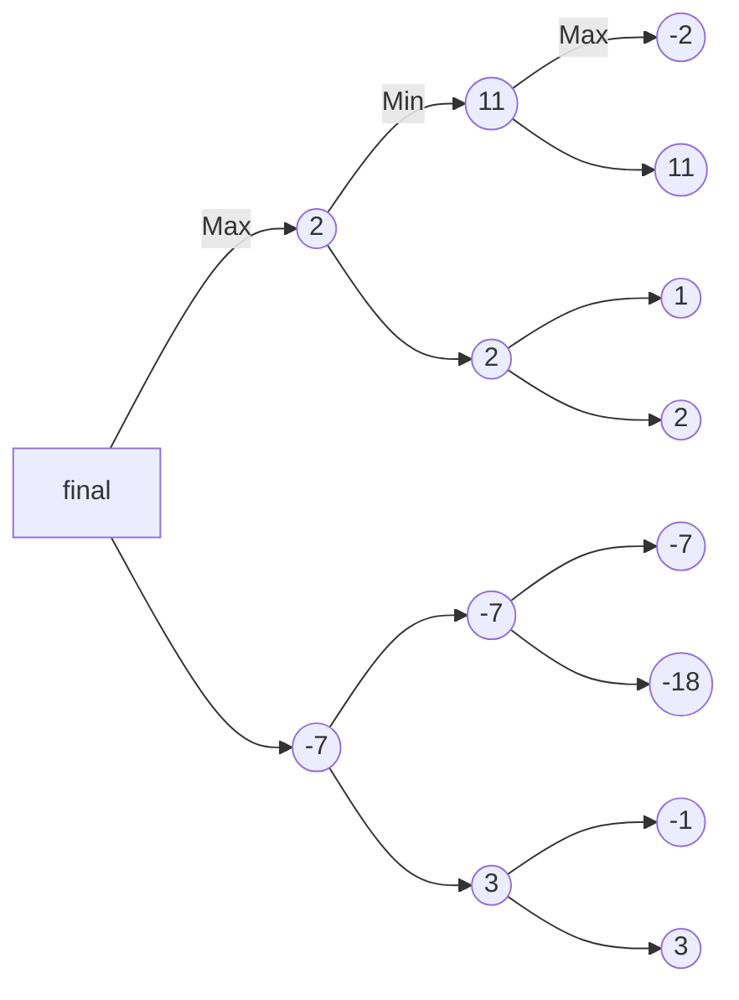

# Connect4 
In this Project I built a Connect4, the implementation includes both single player & multi player. The multiplayer feature includes 3 varying difficulties ranging from Easy, Medium, and Hard. The game also includes a simple UI and game menus.  This game was built in HTML/CSS & Javascript, taking advantage of the p5.js library.

## UI
The User Interface currently consists of 2 menu's one to select the number of players and one if the single player option is selected then takes you to a page to select the difficulties. In the future I plan on adding a settings menu to access in game.

## Difficulties
The difficulties range from easy, medium, and hard. The easy difficulty is built using p5.js's random function, by inputting the valid locations into the random function and an output. The medium uses's the scoring system implemented for minimax algorithm, by just judging each score in a row and choosing the most advantageous option. The Hard mode uses the mini-max algorithm AI, by using the scoring system on a set number of steps and choosing the location that results in the best score looking at multiple moves.

## The Minimax Algorithm

The minimax algorithm uses the scoring system on the connect four by looking into the future over a certain number of iterations, creating a tree over where the algorithm takes the min then the max dependent on who's turn it is. Essentially its trying to make the best move under the assumption the opponent is making there best move.

The tree produced is show below:

